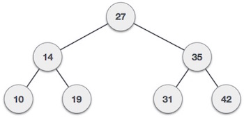
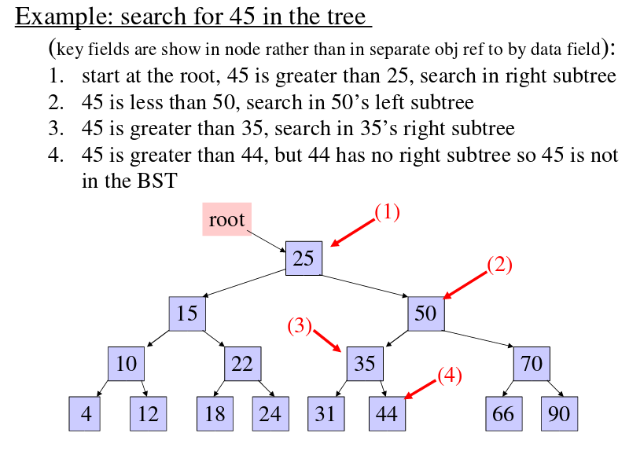
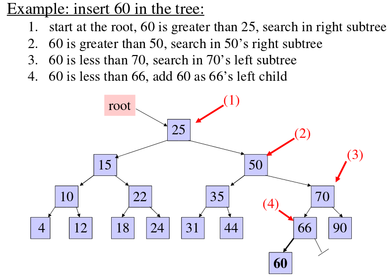
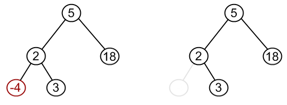
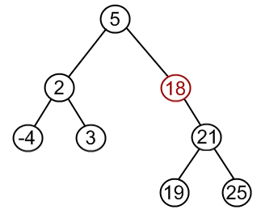
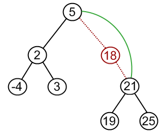
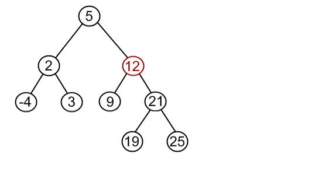
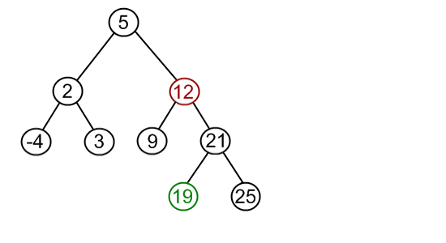
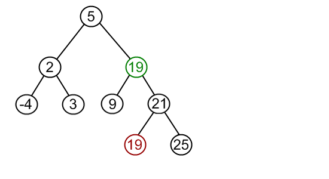
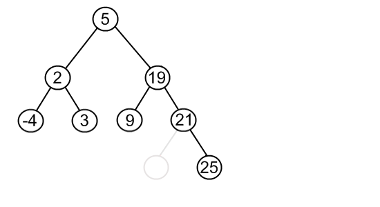

# Binary Search Tree (BST)

A **Binary Search Tree (BST)** is a tree in which all the nodes follow the below-mentioned properties −

- The left subtree of a node contains only nodes with keys less than the node’s key.
- The right subtree of a node contains only nodes with keys greater than the node’s key.
- The left and right subtree each must also be a binary search tree.

BST is a collection of nodes arranged in a way where they maintain BST properties. Each node has a key and an associated value. While searching, the desired key is compared to the keys in BST and if found, the associated value is retrieved.

## Basic Operations:

Following are the basic operations of a tree −

- **Search** − Searches an element in a tree.
- **Insert** − Inserts an element in a tree.
- **Pre-order Traversal** − Traverses a tree in a pre-order manner.
- **In-order Traversal** − Traverses a tree in an in-order manner.
- **Post-order Traversal** − Traverses a tree in a post-order manner.

### Searching

To search a given key in Binary Search Tree, we first compare it with root, if the key is present at root, we return root. If key is greater than root’s key, we recur for right subtree of root node. Otherwise we recur for left subtree.

### Insertion

Whenever an element is to be inserted, first locate its proper location. Start searching from the root node, then if the data is less than the key value, search for the empty location in the left subtree and insert the data. Otherwise, search for the empty location in the right subtree and insert the data.

### Deletion

When we delete a node, there possibilities arise.
- **Node to be deleted is leaf:** Simply remove from the tree.

- **Node to be deleted has only one child:** Copy the child to the node and delete the child.

- **Node to be deleted has two children:** Find inorder successor of the node. Copy contents of the inorder successor to the node and delete the inorder successor.

### Tree Traversal

Traversal is a process to visit all the nodes of a tree and may print their values too. Because, all nodes are connected via edges (links) we always start from the root (head) node. That is, we cannot randomly access a node in a tree.

Unlike linear data structures (Array, Linked List, Queues, Stacks, etc.) which have only one logical way to traverse them, trees can be traversed in different ways. Following are the generally used ways for traversing trees.

#### In-order Traversal (Left, Root, Right)

In this traversal method, the left subtree is visited first, then the root and later the right sub-tree.

**In-order: A, B, C, D, E, F, G, H, I**

- Check if the current node is empty / null.
- Traverse the left subtree by recursively calling the in-order function.
- Display the data part of the root (or current node).
- Traverse the right subtree by recursively calling the in-order function.

In a search tree, in-order traversal retrieves data in sorted order.

#### Pre-order Traversal (Root, Left, Right)

In this traversal method, the root node is visited first, then the left subtree and finally the right subtree.

**Pre-order: F, B, A, D, C, E, G, I, H**

- Check if the current node is empty / null.
- Display the data part of the root (or current node).
- Traverse the left subtree by recursively calling the pre-order function.
- Traverse the right subtree by recursively calling the pre-order function.

#### Post-order Traversal (Left, Right, Root)

In this traversal method, the root node is visited last, hence the name. First we traverse the left subtree, then the right subtree and finally the root node.

**Post-order: A, C, E, D, B, H, I, G, F**

- Check if the current node is empty / null.
- Traverse the left subtree by recursively calling the post-order function.
- Traverse the right subtree by recursively calling the post-order function.
- Display the data part of the root (or current node).

[More about Tree traversal](https://en.wikipedia.org/wiki/Tree_traversal)

### Complexity Analysis
- Insertion - O(log n)
- Deletion - O(log n)
- Access - O(log n)
- Search - O(log n)

### More on this topic
- https://www.tutorialspoint.com/data_structures_algorithms/binary_search_tree.htm
- http://www.algolist.net/Data_structures/Binary_search_tree
- http://quiz.geeksforgeeks.org/binary-search-tree-set-1-search-and-insertion/
- http://quiz.geeksforgeeks.org/binary-search-tree-set-2-delete/
- https://en.wikibooks.org/wiki/Data_Structures/Trees#Binary_Search_Trees
