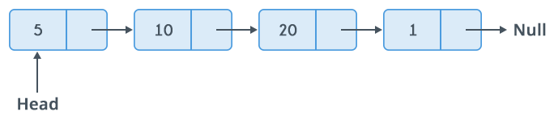
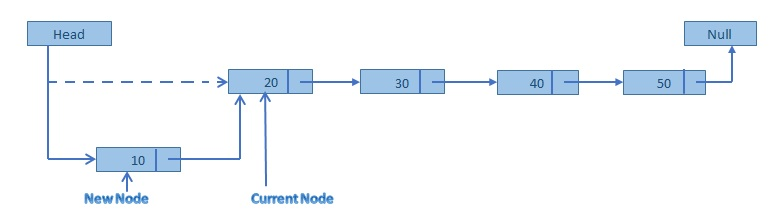
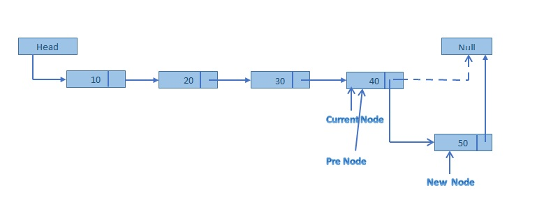
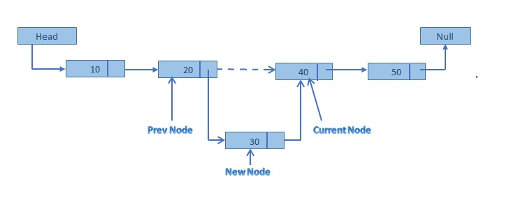
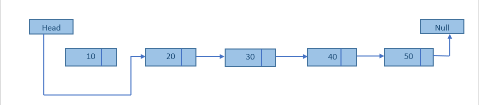
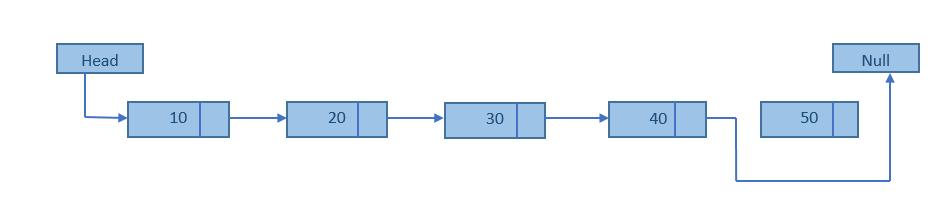
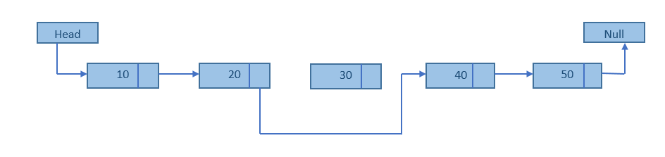
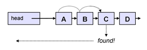
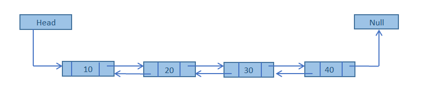
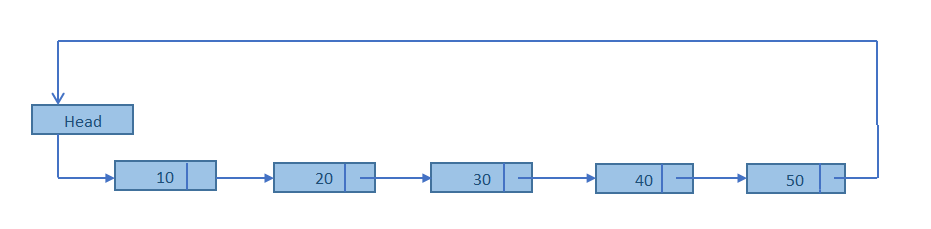

# Linked List

A **linked list** is a linear data structure where each element is a separate object.
Each element (known as *node*) of a list is comprising of two items:
 - the data and
 - a reference to the next node.

The last node has a reference to `null`. The entry point into a linked list is called the `head` of the list. It should be noted that head is not a separate node, but the reference to the first node. If the list is empty then the head is a null reference.

A linked list is a dynamic data structure. The number of nodes in a list is not fixed and can grow and shrink on demand. Any application which has to deal with an unknown number of objects can use a linked list.

## Basic Operations:

Following are the basic operations supported by a list.

### Insertion

In order to add data to the list, we would need to create a new node (to store the new piece of data), and then manipulate the links so that the chain would also include this new node.

In a single linked list, the insertion operation can be performed in three ways.

* **Inserting At Beginning of the list**
* **Inserting At End of the list**
* **Inserting At Specific location in the list**

#### Inserting At Beginning of the list

* Create a new NODE with given value.
* Set the new NODE's next reference, to what the HEAD is pointing to
* Set the HEAD reference to the new NODE

#### Inserting At End of the list

* Seek through the list until the final NODE is reached
* Create a new NODE, using the data to be inserted
* Set the new NODE's next reference to null
* Set the last NODE's next reference to the new NODE

#### Inserting to the Middle

* Seek through the list, until the NODE before the desired insertion point is found.
* Create the new NODE, using the data to be inserted
* Set the new NODE's next reference to the same as the next reference of the NODE before the insertion point
* Set the NODE before the insertion point's next reference to the new NODE

### Deletion

Searching and deletion operations are related by the fact that in order to delete an item from the list, it must first be found. Deletion of nodes relies on manipulating the links between data items so one is 'left out' of the chain - so it is then deleted by the garbage collector or the memory can be freed by the code itself.

In a single linked list, the deletion operation can be performed in three ways.

* **Deleting from Beginning of the list**
* **Deleting from End of the list**
* **Deleting a specific node**

#### Deleting from Beginning of the list

* If the list is not empty, just referencing the current HEAD to the next Node will remove the front Node

#### Deleting from End of the list

* Seek through the list until the previous node to the final NODE is reached
* Reference this previous node to null and The target node is then no longer referred to by any variables and will be considered as deleted.

#### Deleting a specific node

* Search the data item to delete.
* If found, go to the node immediately preceding the target. This cannot be done by simply following links; the search will have to hold the 'previous' node, as well as the 'currently testing' node during the search operation.
* Set the previous node's next reference to point to the same node as the target node's next reference. The target node is then no longer referred to by any variables, and is deleted by the garbage collector.

### Searching

In order to search through the list (to find a piece of data, or an insertion point for some new data), the only option is to traverse through the data one by one, from the start. This is known as a linear search. More efficient search techniques (such as the binary search) cannot be performed, as the link structure between data forces sequential access.

The step-by-step algorithm to search is, starting at the first data node, and comparing the search key with the corresponding data in the node:

* if the data matches, the search is complete.
* if there is no match, move to the next node and repeat;
* If the next reference is null, the end of the list has been reached; therefore, the data does not exist in the list. The algorithm can now terminate.

### Complexity Analysis

- Indexing - *O(n)*
- Search - *O(n)*
- Insertion
    - at beginning - *O(1)*
    - at end - *O(n)*
    - in middle - *Searching O(n) + insertion O(1)*
- Deletion
    - at beginning- *O(1)*
    - at end - *O(n)*
    - in middle - *Searching O(n) and deletion O(1)*
- Space - O(n)

### Variations

#### Doubly Linked List

In a single linked list, every node has link to its next node in the sequence. So, we can traverse from one node to other node only in one direction and we can not traverse back.

Double linked list is a sequence of elements in which every element has links to its previous element and next element in the sequence.

In double linked list, every node has link to its previous node and next node. So, we can traverse forward by using next field and can traverse backward by using previous field.

Doubly Linked List Implementation is almost same as the Singly Linked List except the places where we can use the facility of the Double Pointers (`next` and `prev`). In every operations we need to be careful about updating both of them.

[More about Doubly Linked List Operations](http://btechsmartclass.com/DS/U1_T12.html)

#### Circular Linked List

In single linked list, every node points to its next node in the sequence and the last node points NULL. But in circular linked list, every node points to its next node in the sequence but the last node points to the first node in the list. That means circular linked list is similar to the single linked list except that the last node points to the first node in the list.

Circular lists are useful in applications to repeatedly go around the list (implementing round-robin algorithms). For example, when multiple applications are running on a PC, it is common for the operating system to put the running applications on a list and then to cycle through them, giving each of them a slice of time to execute, and then making them wait while the CPU is given to another application. It is convenient for the operating system to use a circular list so that when it reaches the end of the list it can cycle around to the front of the list.

[More about Circular Linked List Operations](http://btechsmartclass.com/DS/U1_T11.html)

#### Array vs Linked List
http://www.geeksforgeeks.org/linked-list-vs-array/

### More on this topic
- https://en.wikipedia.org/wiki/Linked_list
- https://www.hackerearth.com/practice/data-structures/linked-list/singly-linked-list/tutorial/
- https://www.tutorialspoint.com/data_structures_algorithms/linked_list_algorithms.htm
