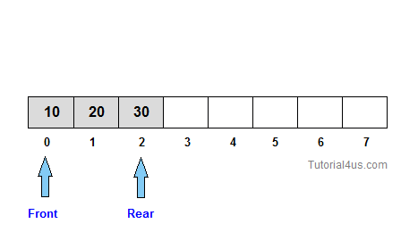
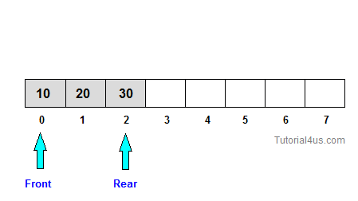

# Queue

**Queue** is an abstract data structure, somewhat similar to Stacks. Unlike stacks, a queue is open at both its ends. One end is always used to insert data (enqueue) and the other is used to remove data (dequeue). Queue follows First-In-First-Out methodology, i.e., the data item stored first will be accessed first.

A real-world example of queue can be a single-lane one-way road, where the vehicle enters first, exits first. More real-world examples can be seen as queues at the ticket windows and bus-stops.


### Basic Operations:

Queue operations may involve initializing or defining the queue, utilizing it, and then completely erasing it from the memory.. Apart from these basic stuffs, a queue is used for the following two primary operations −


#### Enqueue

**Enqueue** means adding (store) an item to the queue.

Queue maintains two data pointers, **front** and **rear**. To insert a new element to the Queue, first check if the Queue is full (for fixed size Queue). If the queue is not full then insert the element at the rear of the Queue and update the *rear*.




#### Dequeue

**Dequeue** means removing (access) an item from the queue. Accessing data from the queue is a process of two tasks − access the data where front is pointing and remove the data after access. Also remember to update the *front*.



To use a queue efficiently, we need to check the status of queue as well. For the same purpose, the following functionality are available too −

- **peek()** − get the first data element of the queue, without removing it.
- **isEmpty()** − check if queue is empty.

```
In PHP, Queue can be easily implemented by an Array. PHP have built-in methods called 'array_unshift'(insert at the beginning of an array) and 'array_pop'(remove from the end of an array), which can mimic the operations of an Queue.
```

#### Complexity Analysis
- Insertion - O(1)
- Deletion - O(1) (If implemented with array, then deletion will take O(n) for shifting elements to rearrange the Queue)
- Access - O(n)
- Search - O(n)

### More on this topic
- https://en.wikipedia.org/wiki/Queue_(abstract_data_type)
- https://www.tutorialspoint.com/data_structures_algorithms/dsa_queue.htm
- https://en.wikibooks.org/wiki/Data_Structures/Stacks_and_Queues
