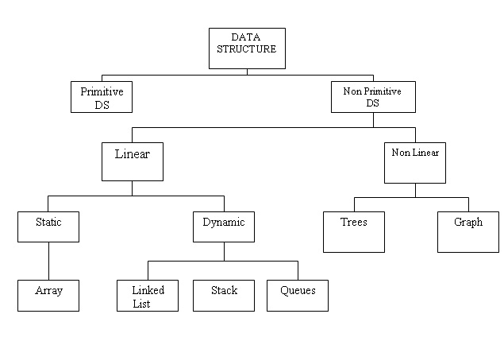

# Data Structure

Data Structure is a way of collecting and organizing data in such a way that we can perform operations on these data in an effective way.

A Data Structure is a named group data of different data types which can be processed as a single unit. A data structure has well-defined operations, behavior and properties.

Different Data Structures are as follows:

### Operations on Data Structures

The basic operations that are performed on data structures are as follows:

* **Insertion:** Insertion means addition of a new data element in a data structure.

* **Deletion:** Deletion means removal of a data element from a data structure if it is found.

* **Searching:** Searching involves searching for the specified data element in a data structure.

* **Traversal:** Traversal of a data structure means processing all the data elements present in it.

* **Sorting:** Arranging data elements of a data structure in a specified order is called sorting.

* **Merging:** Combining elements of two similar data structures to form a new data structure of the same type, is called merging.

### More on this topic
- [Data Structure - Wikipedia](https://en.wikipedia.org/wiki/Data_structure)
- [Data Structure Tutorial - TopCoder](https://www.topcoder.com/community/data-science/data-science-tutorials/data-structures/)
- [Data Structures - GeeksforGeeks](http://www.geeksforgeeks.org/data-structures/)
