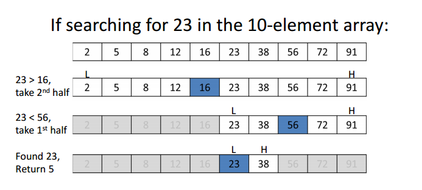

# Binary Search

**Binary search** is an efficient algorithm for finding an item from an ordered list of items. It works by repeatedly dividing in half the portion of the list that could contain the item, until you've narrowed down the possible locations to just one.

**For a binary search to work, it is mandatory for the target array to be sorted.**

In the sequential search, when we compare against the first item, there are at most *(n−1)* more items to look through if the first item is not what we are looking for. Instead of searching the list in sequence, a binary search will start by examining the middle item. If that item is the one we are searching for, we are done. If it is not the correct item, we can use the ordered nature of the list to eliminate half of the remaining items. If the item we are searching for is greater than the middle item, we know that the entire lower half of the list as well as the middle item can be eliminated from further consideration. The item, if it is in the list, must be in the upper half.

We can then repeat the process with the upper half. Start at the middle item and compare it against what we are looking for. Again, we either find it or split the list in half, therefore eliminating another large part of our possible search space.

### Linear Search vs. Binary Search
A linear search looks down a list, one item at a time, without jumping. In complexity terms this is an **O(n)** search - the time taken to search the list gets bigger at the same rate as the list does.

A binary search is when you start with the middle of a sorted list, and see whether that's greater than or less than the value you're looking for, which determines whether the value is in the first or second half of the list. Jump to the half way through the sub-list, and compare again etc. In complexity terms this is an **O(log n)** search - the number of search operations grows more slowly than the list does, because you're halving the "search space" with each operation.

### Complexity Analysis
- Worst Case - O(logn)
- Best Case - O(1)
- Average Case - O(logn)

### More on this topic
- https://en.wikipedia.org/wiki/Binary_search_algorithm
- https://www.khanacademy.org/computing/computer-science/algorithms/binary-search/a/binary-search
- https://www.topcoder.com/community/data-science/data-science-tutorials/binary-search/
- https://www.tutorialspoint.com/data_structures_algorithms/binary_search_algorithm.htm
