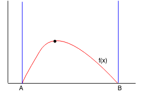
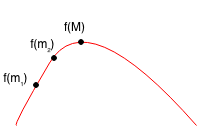
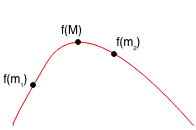
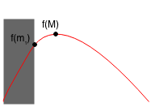
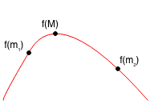
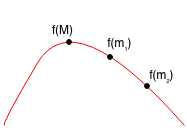
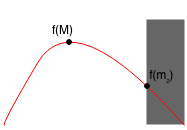

# Ternary Search

**Ternary search** algorithm is a technique in computer science for finding the minimum or maximum of a [unimodal](https://en.wikipedia.org/wiki/Unimodality) function. A ternary search determines either that the minimum or maximum cannot be in the first third of the domain or that it cannot be in the last third of the domain, then repeats on the remaining two-thirds.
Unimodal functions are functions that, have a single highest/lowest value.

Suppose we have a function f(x) with only one max point between A and B. We want to find the point (M, f(M)) where f(M) is the maximum between A and B.

We split the range from A to B into three intervals. At every iteration of our algorithm, we can narrow down the range by 1/3 and we have a new interval. At every step, we can remove one of the intervals based on the following:

Let m1 by 1/3 of the way from A and B and let m2 be 2/3 of the way from B.

**Case 1 :** f(m1) < f(m2)

  * **Case 1.1:** m1 < m2 < M, so m1 < M

  

  * **Case 1.2:** m1 < M < m2, so m1 < M

  

  * **Case 1.3:** M < m1 < m2 is not possible.

Thus if f(m1) < f(m2), then m1 < M, so we only need to search from m1 to B.

**Case 2:** f(m1) >= f(m2)

  * **Case 2.1:** m1 < M < m2, so M < m2

  

  * **Case 2.2:** M < m1 < m2, so M < m2

  

  * **Case 2.3:** m1 < m2 < M is not possible

Thus, if f(m1) >= f(m2), then M < m2, so we only need to search from A to m2.

Therefore, based on the values of f(m1) and f(m2), we can always remove a third of the range. We can keep repeating this until the range is within a very small threshold/absolute Precision such as 0.0001.

#### Binary Search vs. Ternary Search
Binary search looks a zero or a specific value in case of monotonic(Non-increasing or non-decreasing) input; ternary search is used to locate an extremum for unimodal(Having a single extremum) inputs.

#### Complexity Analysis
- Average Case - O(logn)

### More on this topic
- https://en.wikipedia.org/wiki/Ternary_search
- https://www.hackerearth.com/practice/algorithms/searching/ternary-search/tutorial/
- http://matteolandi.blogspot.com/2012/11/ternary-search.html
- http://www.thecshandbook.com/Ternary_Search
