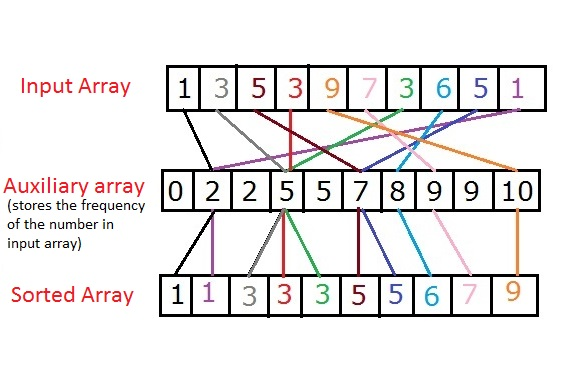

# Counting Sort

In **Counting sort**, the frequencies of distinct elements of the array to be sorted is counted and stored in an auxiliary array, by mapping its value as an index of the auxiliary array.

#### Idea:

Let's assume that, array **A** of size **N** needs to be sorted.

- Initialize the auxiliary array **Aux[]** with **0**.
Note: The size of this array should be greater than the Max value of the elements in **A[]**.
- Traverse array **A** and store the count of occurrence of each element in the appropriate index of the **Aux** array, which means, execute **Aux[A[i]]++** for each **i**, where **i** ranges from **[0,N−1]**.
- Initialize the empty array **sortedA[]**
- Traverse array **Aux** and copy **i** into **sortedA** for **Aux[i]** number of times where **0≤i≤max(A[])**.

Simply speaking, you just need to count the frequency of each of the elements in the given array **A** and based on that frequency count write those elements in a new array, so that we would finally have an array with the sorted elements.

#### Video Tutorial

#### Complexity Analysis
Time Complexity: O(n+k), where **n** is the size of the input array and **k** is the Max value of the elements in the given Array.

### More on this topic
- [Counting Sort - WikiPedia](https://en.wikipedia.org/wiki/Counting_sort)
- [Counting Sort - HackerEarth Tutorial](https://www.hackerearth.com/practice/algorithms/sorting/counting-sort/tutorial/)
