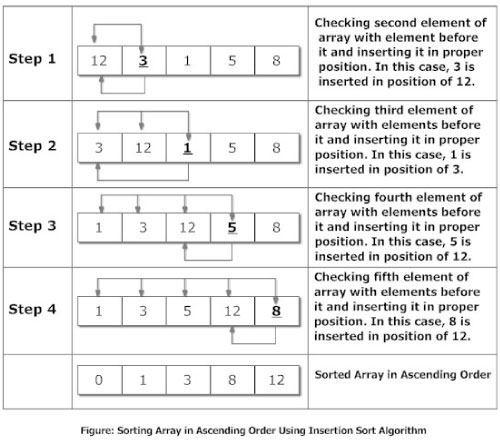

# Insertion Sort

**Insertion sort** does exactly what you would expect: it inserts each element of the array into its proper position, leaving progressively larger stretches of the array sorted. What this means in practice is that the sort iterates down an array, and the part of the array already covered is in order; then, the current element of the array is inserted into the proper position at the head of the array, and the rest of the elements are moved down, using the space just vacated by the element inserted as the final space.

#### A visualization on Insertion Sort

#### Complexity Analysis
- Worst Case - О(n2)
- Average Case - О(n2)
- Best Case - O(n)

### More on this topic
- [Insertion Sort - WikiPedia](https://en.wikipedia.org/wiki/Insertion_sort)
- [Insertion Sort - geeksforgeeks](http://quiz.geeksforgeeks.org/insertion-sort/)
