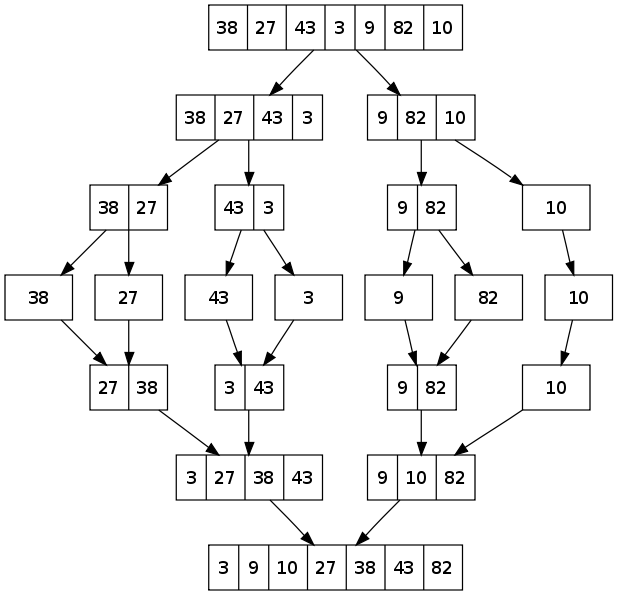

# Merge Sort

**Merge sort** is a divide-and-conquer algorithm based on the idea of breaking down a list into several sub-lists until each sublist consists of a single element and merging those sublists in a manner that results into a sorted list.

#### Idea:
- Divide the unsorted list into **N** sublists, each containing **1** element.
- Take adjacent pairs of two singleton lists and merge them to form a list of 2 elements. **N** will now convert into **N/2** lists of size 2.
- Repeat the process till a single sorted list of obtained.

While comparing two sub-lists for merging, the first element of both lists is taken into consideration. While sorting in ascending order, the element that is of a lesser value becomes a new element of the sorted list. This procedure is repeated until both the smaller sub-lists are empty and the new combined sub-list comprises all the elements of both the sub-lists.

#### A visualization on Merge Sort

*An example of merge sort. First divide the list into the smallest unit (1 element), then compare each element with the adjacent list to sort and merge the two adjacent lists. Finally all the elements are sorted and merged. (image source-wikipedia)*

#### Complexity Analysis
- Worst Case - O(nlogn)
- Average Case - O(nlogn)
- Best Case - O(nlogn)

### More on this topic
- [Merge Sort - Wikipedia](https://en.wikipedia.org/wiki/Merge_sort)
- [Merge Sort - KhanAcademy Tutorial](https://www.khanacademy.org/computing/computer-science/algorithms/merge-sort/a/overview-of-merge-sort)
- [Merge Sort - HackerEarch Tutorial](https://www.hackerearth.com/practice/algorithms/sorting/merge-sort/tutorial/)
