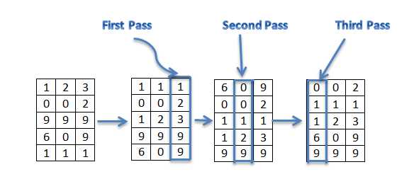

# Radix Sort

**Radix sort** is a non-comparative integer sorting algorithm that sorts data with integer keys by grouping keys by the individual digits which share the same significant position and value. The idea of Radix Sort is to do digit by digit sort starting from least significant digit to most significant digit. Radix sort uses [counting sort](../Counting%20Sort/) as a subroutine to sort.

#### Idea:


Assume the input array is:
123, 2, 999, 609, 111

Based on the algorithm, we will sort the input array according to the one's digit (least significant digit).

```
[0]:
[1]: 111
[2]: 2
[3]: 123
[4]:
[5]:
[6]:
[7]:
[8]:
[9]: 999, 609
```

So, the array becomes 111, 2, 123, 999, 609. Note that we placed 999 before 609 because it appeared first.

Now, we'll sort according to the ten's digit:

```
[0]: 609, 2
[1]: 111
[2]: 123
[3]:
[4]:
[5]:
[6]:
[7]:
[8]:
[9]: 999
```

Now, the array becomes : 609, 2, 111, 123, 999

Finally , we sort according to the hundred's digit (most significant digit):

```
[0]: 2
[1]: 111, 123
[2]:
[3]:
[4]:
[5]:
[6]: 609
[7]:
[8]:
[9]: 999
```

The array becomes : 2, 111, 123, 609, 999 which is sorted. This is how Radix Sort algorithm works.


#### Video Tutorial
<a href="http://www.youtube.com/watch?feature=player_embedded&v=YXFI4osELGU" target="_blank"></a>


#### Complexity Analysis
The time complexity for radix sort is : O(d(n+b)), where b is the base for representing numbers, for example, for decimal system, b is 10. If k is the maximum possible value, then d would be O(log<sub>b</sub>(k)). So overall time complexity is O((n+b) * logb(k))

### More on this topic
- [Radix Sort - WikiPedia](https://en.wikipedia.org/wiki/Radix_sort)
- [Radix Sort - HackerEarth Tutorial](https://www.hackerearth.com/practice/algorithms/sorting/radix-sort/tutorial/)
- [Radix Sort - geeksforgeeks](http://www.geeksforgeeks.org/radix-sort/)
