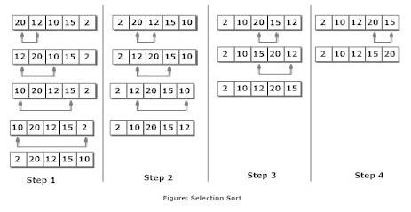

# Selection Sort

**Selection sort** is one of the simplest sorting algorithm.
It works by selecting the smallest (or largest, if you want to sort from big to small) element of the array and placing it at the head of the array. Then the process is repeated for the remainder of the array; the next largest element is selected and put into the next slot, and so on down the line.

Selection sort algorithm starts by compairing first two elements of an array and swapping if necessary, i.e., if you want to sort the elements of array in ascending order and if the first element is greater than second then, you need to swap the elements but, if the first element is smaller than second, leave the elements as it is. Then, again first element and third element are compared and swapped if necessary. This process goes on until first and last element of an array is compared. This completes the first step of selection sort.

If there are n elements to be sorted then, the process mentioned above should be repeated n-1 times to get required result.

#### A visualization on Selection Sort

*Selection sort animation. Red is current min. Yellow is sorted list. Blue is current item.*

#### Complexity Analysis
- Worst Case - O(n2)
- Average Case - O(n2)
- Best Case - O(n2)

### More on this topic
- [Selection Sort - WikiPedia](https://en.wikipedia.org/wiki/Selection_sort)
- [Selection Sort - geeksforgeeks](http://quiz.geeksforgeeks.org/selection-sort/)
